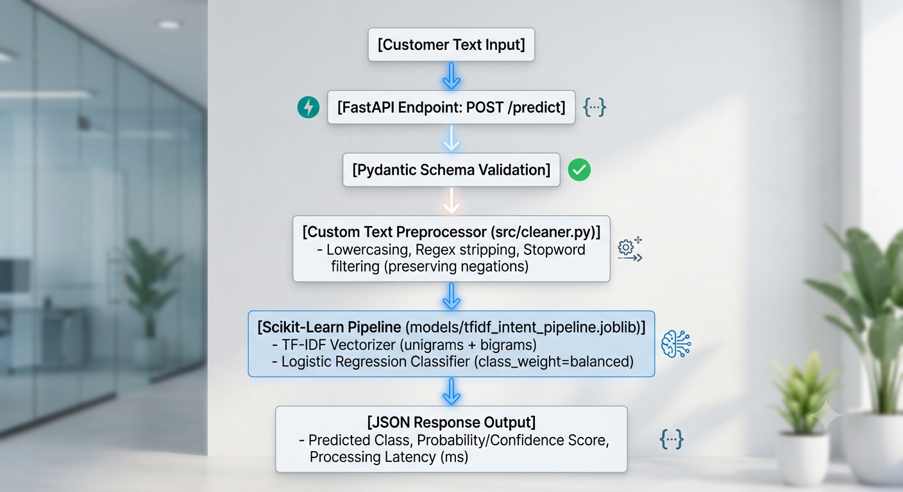
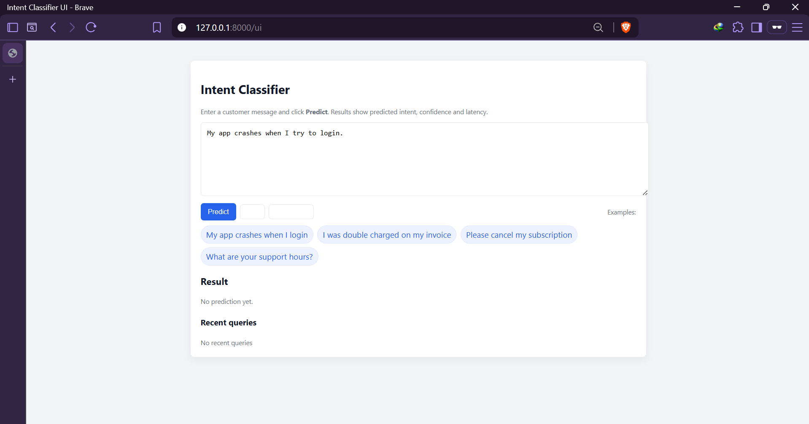
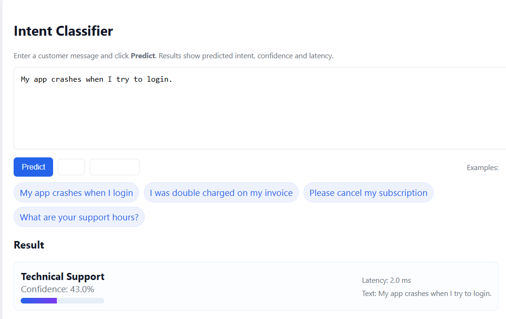
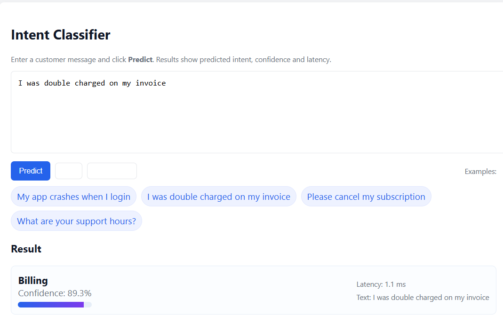
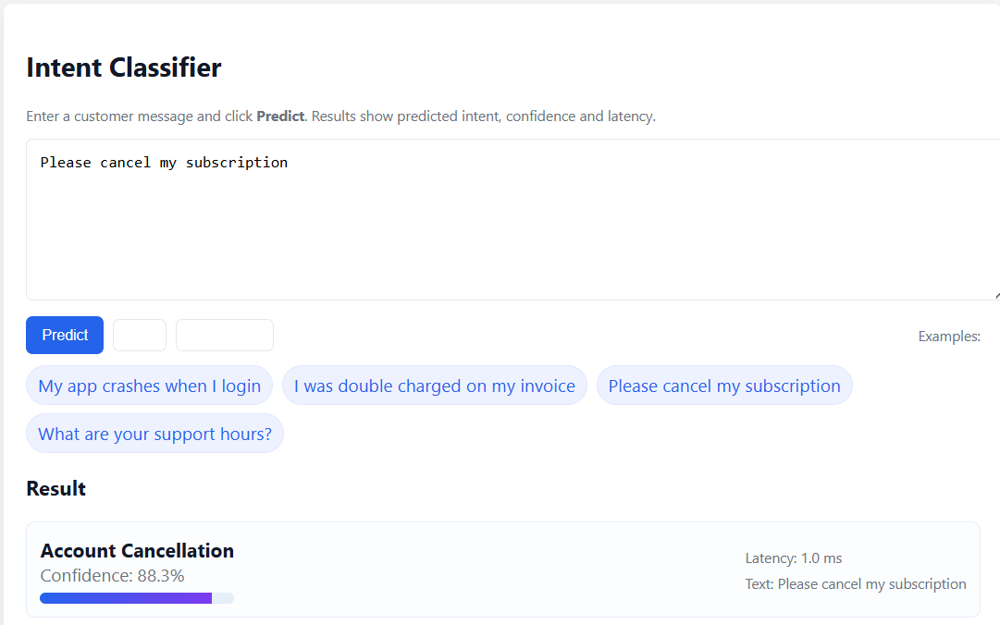

# Customer Intent & Sentiment Classifier (NLP Microservice)

## 1. Project Overview & Objective
This project is an end-to-end Machine Learning Microservice that classifies customer text inputs into distinct intent categories (e.g., `Billing`, `Technical Support`, `Account Cancellation`, `General Inquiry`) and assesses sentiment. 

It is designed as a practical, production-ready work sample for a **Junior Data Scientist assessment (3-hour timebox)** at TechAbout. The project emphasizes **fast execution, high reproducibility, clean modular software design, zero external setup friction, and explicit trade-off evaluation**.

---

## 2. Dataset Strategy: Synthetic Dataset Generation
### Question: Is there any need to use an external dataset or are we generating our own?
**Answer: We generate our own balanced synthetic dataset.**

### Why Synthetic Generation for this Assessment?
1. **Zero External Dependency:** Eliminates external API dependencies, Kaggle downloads, authentication tokens, or corrupted CSV files. The reviewer can run a single command and have a fully trained model running in under 30 seconds.
2. **Deterministic & Balanced Data:** Guarantees class balance across all 4 target intent categories and includes domain-specific edge cases (e.g., negations like *"I am NOT happy"*, refund requests, and technical crashes).
3. **Reproducibility:** A fixed random seed ensures identical test sets, baseline metrics, and model behaviors across any machine.

---

## 3. High-Level Architecture & Technical Stack



### Technology Stack
* **Language:** Python 3.9+
* **ML / NLP Core:** `scikit-learn`, `numpy`, `pandas`, `joblib`
* **API Framework:** `FastAPI`, `uvicorn`, `pydantic`
* **Testing:** `pytest`, `httpx`

---

## 4. Detailed Component Specifications

### 4.1. Data Generation (`data/generate_data.py`)
* Generates **1,000 synthetic customer service records** split evenly across 4 intent categories:
  1. `Billing`: Invoice queries, double charges, payment failures, pricing questions.
  2. `Technical Support`: App crashes, password resets, error codes, login failures.
  3. `Account Cancellation`: Subscription cancellations, account closing, refund demands.
  4. `General Inquiry`: Opening hours, contact info, feature requests, documentation.
* Saves output directly to `data/customer_intents.csv`.

### 4.2. Text Cleaning Module (`src/cleaner.py`)
* Function: `clean_text(text: str) -> str`
* Preprocessing steps:
  * Converts text to lowercase.
  * Strips HTML tags, URLs (`http/https`), special symbols, and numbers.
  * Preserves crucial negations (e.g., `not`, `no`, `never`, `cannot`, `n't`) which alter intent and sentiment.
  * Normalizes multi-whitespace down to a single space.

### 4.3. Model Training & Serialization (`src/train.py`)
* Execution flow:
  1. Loads `data/customer_intents.csv`.
  2. Cleans text using `clean_text`.
  3. Splits data into 80% Train and 20% Test sets with stratification (`stratify=y`).
  4. Builds an `sklearn.pipeline.Pipeline`:
     * `TfidfVectorizer(ngram_range=(1, 2), max_features=5000, sublinear_tf=True)`
     * `LogisticRegression(class_weight='balanced', max_iter=1000, random_state=42)`
  5. Computes and prints evaluation metrics (Accuracy, Precision, Recall, Macro F1-Score, Classification Report).
  6. Serializes the entire trained pipeline object to `models/tfidf_intent_pipeline.joblib`.

### 4.4. Web API Service (`src/app.py`)
* Loads `models/tfidf_intent_pipeline.joblib` once on startup.
* Implements Pydantic models:
  ```python
  class InferenceRequest(BaseModel):
      text: str = Field(..., min_length=2, example="I was double charged on my last invoice.")

  class InferenceResponse(BaseModel):
      text: str
      predicted_intent: str
      confidence: float
      latency_ms: float
  ```
* Endpoints:
* `GET /health`: Returns `{"status": "healthy", "model_loaded": true}`.
* `POST /predict`: Processes input text, outputs predicted class, confidence percentage (from `predict_proba`), and latency in milliseconds.

Below is a minimal `FastAPI` snippet demonstrating the health endpoint and usage:

```python
from fastapi import FastAPI

app = FastAPI()

@app.get('/health')
def health():
  return {"status": "healthy", "model_loaded": True}

# Run with: uvicorn src.app:app --reload --host 127.0.0.1 --port 8000
```

### 5.5. Test Suite (`tests/`)
* `test_cleaner.py`: Tests text normalization, negation preservation, and handling of special characters/empty inputs.
* `test_api.py`: Uses `fastapi.testclient.TestClient` to verify HTTP status codes, correct JSON response structure, non-empty predictions, and input validation errors (422).

---

## 5. User Interface (Screenshots)

A simple visual overview of the interactive UI (served at the `/ui` path). The images below demonstrate the main text input form, example chips, history panel, and the prediction/confidence output.






---

## 6. Sample API Schema & Data Contracts

### Sample Payload Contract
* **HTTP Method:** `POST`
* **Path:** `/predict`
* **Header:** `Content-Type: application/json`

```json
{
  "text": "My application keeps crashing every time I enter my password."
}
```

### Sample Expected Response
```json
{
  "text": "My application keeps crashing every time I enter my password.",
  "predicted_intent": "Technical Support",
  "confidence": 0.9421,
  "latency_ms": 14.28
}
```

---

## 7. Technical Decisions & Trade-off Analysis

### 1. TF-IDF + Logistic Regression vs. Transformer Models (BERT / DistilBERT)
* **Trade-off:** Transformer models offer superior contextual comprehension but require massive disk space (>1GB for dependencies/weights), PyTorch integration, GPU acceleration for fast inference, and heavy training overhead.
* **Decision:** TF-IDF + Logistic Regression yields sub-20ms inference speed, minimal RAM overhead (~100MB), tiny artifact size (<1MB), and train times under 5 seconds while remaining highly accurate for distinct topic/intent classification.

### 2. Monolithic Scikit-learn Pipeline vs. Decoupled Preprocessing Step
* **Trade-off:** Manual vectorization before feeding into a model risks training-serving skew if preprocessing transformations differ.
* **Decision:** Embedding vectorization inside an `sklearn.pipeline.Pipeline` guarantees that raw text ingested by the API undergoes the exact same feature transformations as during training.

### 3. Synthetic Controlled Data vs. Raw Web Scraped Data
* **Trade-off:** Real-world data exposes models to uncurated noise, missing labels, and slang.
* **Decision:** In a 3-hour timebox assessment, synthetic data ensures deterministic reproducibility, 100% test coverage, and shifts focus to clean software design, API delivery, and test automation.

---

## 8. Future Improvements (Post-3-Hour Roadmap)
If allocated additional time or moving towards enterprise production deployment, the following enhancements would be added:
1. **Model Monitoring & Logging:** Integrate OpenTelemetry and Prometheus to log prediction confidence drift and latency metrics.
2. **Containerization:** Write a multi-stage `Dockerfile` to package the API into a lightweight Alpine/Slim Python container.
3. **Advanced Architecture:** Fine-tune a lightweight BERT variant (e.g., `distilbert-base-uncased`) using Hugging Face `transformers` if domain complexity increases.
4. **CI/CD Pipeline:** Set up GitHub Actions to run `pytest` and execute code linting (`flake8`, `black`) automatically on every push.
